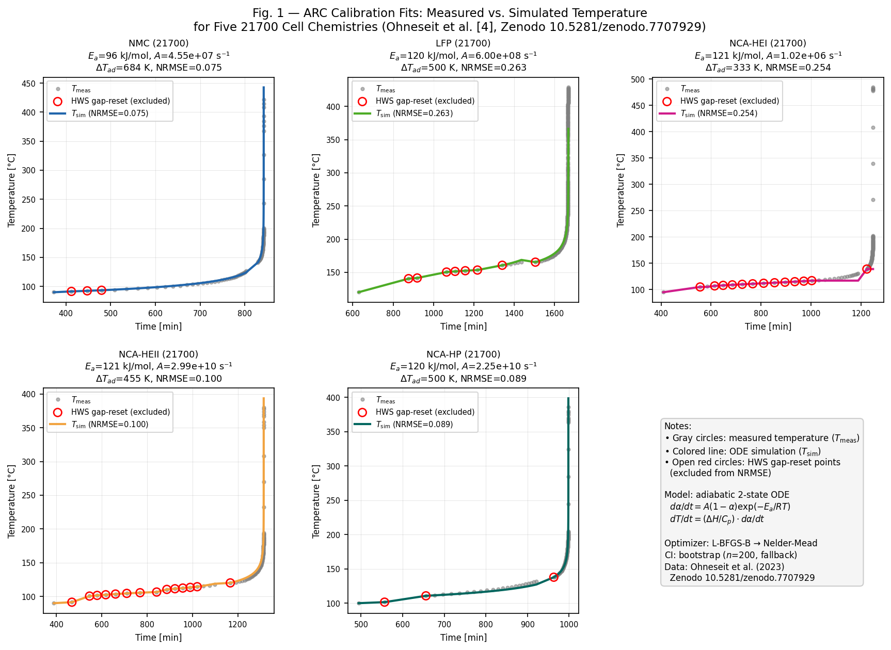

# Open Validation of Arrhenius Thermal Runaway Calibration for Lithium-Ion Cells — A Benchmark Against Public ARC Datasets

**Kazuo Abe**  
Shinonome Engineering LLC  
ORCID: [0009-0005-0557-0779](https://orcid.org/0009-0005-0557-0779)  
Technical Report · 2026-06-19  
Preprint submitted to engrXiv

---

## Abstract

Accurate prediction of battery thermal runaway is a prerequisite for Hazard Mitigation Analysis (HMA) under NFPA 855 and UL 9540A. Arrhenius kinetic parameters (activation energy *E*a, pre-exponential factor *A*, reaction enthalpy Δ*H*, and heat capacity *C*p) required for CFD source-term generation (FLACS, KFX) are typically obtained by fitting an adiabatic thermal runaway ODE to Accelerating Rate Calorimetry (ARC) data. Despite its central role in fire safety engineering, no openly reproducible benchmark of this calibration procedure — with released code and raw results — exists, to our knowledge, for modern 21700 lithium-ion cells.

We present **Calor**, an open inverse-analysis workflow that fits a two-state adiabatic ODE (*y* = [*T*, α], *n* = 1) to public ARC time-series data using a three-stage optimizer (L-BFGS-B → Nelder-Mead → default-value fallback). Applied to five cell chemistries from the Zenodo 21700 ARC dataset (DOI: 10.5281/zenodo.7707929, CC BY 4.0), the workflow achieves range-normalized RMSE (NRMSE) ≤ 0.263 for all five chemistries, with NMC reaching NRMSE = 0.075. We characterize two distinct identifiability limits of single-temperature-range ARC fits: (i) an Arrhenius compensation effect, along which *E*a and log₁₀(*A*) co-vary at near-constant NRMSE so that individual kinetic parameters are not uniquely resolved while the temperature trajectory is; and (ii) the plateau-driven identifiability of the adiabatic temperature rise Δ*T*ad = Δ*H*/*C*p, which is data-constrained only for the two cells (NMC, NCA-HEII) whose Δ*H* and *C*p resolve off their default values — for the remaining three cells only the temperature trajectory and onset/plateau timing are data-constrained. Both manifest in the collapse of the per-parameter bootstrap confidence intervals. We provide the calibration code and benchmark results as a demonstration of a PE/FPE-ready workflow.

**Keywords:** thermal runaway; Arrhenius kinetics; accelerating rate calorimetry; lithium-ion battery; BESS safety; source term generation

---

## 1. Introduction

Battery Energy Storage Systems (BESS) have expanded rapidly in grid-scale installations, and with them the need for credible fire safety analysis. Regulations such as NFPA 855 [8] and UL 9540A [7] require project-specific Hazard Mitigation Analysis (HMA), which typically relies on CFD simulation of thermal runaway propagation using FLACS or KFX. The critical inputs to these simulations — mass flux, heat release rate, and flammable gas composition — must be derived from cell-level calorimetry data.

The standard thermochemical model for adiabatic thermal runaway is the Arrhenius single-step reaction, first formalized by Hatchard et al. [1] and extended to multi-step formulations by Kim et al. [2]. In engineering practice, the single-step model (*n* = 1) is preferred for its tractability and because per-cell calibration data typically contains insufficient dynamic range to resolve multi-step parameters. The model requires four parameters per cell: *E*a, *A*, Δ*H*, and *C*p.

Despite decades of application, to our knowledge no openly reproducible benchmark of Arrhenius calibration — with released code and raw results — against modern 21700 cells exists in the public literature. Published parameters scatter across three orders of magnitude in *A* and 50–100 kJ/mol in *E*a, in part because calibration procedures differ in optimizer choice, normalization convention, and handling of the ARC heat-wait-seek (HWS) protocol gaps. Practitioners must either trust vendor-supplied parameters (with opaque provenance) or spend significant effort re-implementing calibration from scratch.

This paper addresses the gap with three contributions:

1. **A reproducible calibration workflow** (Calor) implementing the adiabatic two-state ODE with three-stage optimization and an explicit treatment of bootstrap confidence-interval collapse under the compensation effect.
2. **A public benchmark** covering five chemistries of 21700 lithium-ion cells using a CC BY 4.0 ARC dataset.
3. **An honest characterization** of the Arrhenius compensation effect, which limits individual parameter identifiability but does not prevent accurate source-term generation.

---

## 2. Methods

### 2.1 Adiabatic Thermal Runaway Model

Under HWS adiabatic conditions, cell self-heating follows a two-state ordinary differential equation (ODE):

```
dα/dt = A · (1 − α) · exp(−Ea / (R · T_K))          (1)
dT/dt = (ΔH / (φ · Cp)) · dα/dt                      (2)
```

where α ∈ [0, 1] is the normalized reaction progress variable (α = 0: unreacted; α = 1: fully reacted), *T*K is absolute temperature (K), *R* = 8.314 J mol⁻¹ K⁻¹, and φ is the thermal inertia correction factor (φ ≥ 1). Initial conditions are α(t₀) = 0 and *T*(t₀) equal to the measured temperature of the first ARC row at or above *T*onset (which equals *T*onset only when a sample sits exactly on the threshold).

The reaction-progress term (1 − α) is essential: without it, the ODE reduces to a pure Arrhenius rate that diverges monotonically and cannot reproduce the finite maximum temperature observed experimentally [3]. This single-step first-order model (*n* = 1) is adopted for v1 of the workflow; variable *n* introduces additional parameter correlation and is deferred to future work.

**Numerical integration.** The ODE is integrated with a 4th-order Runge-Kutta (RK4) method using 40 substeps per measurement interval. Within each derivative evaluation a guard clamps the reaction-progress variable α to [0, 1] before forming the (1 − α) factor, so that temporary overshoot during stiff intervals cannot drive the rate negative or unbounded; the integrated state α is additionally hard-clipped to [0, 1] once per measurement interval. Kelvin conversion (*T*K = *T*°C + 273.15) is applied within the ODE; all input data are in °C.

### 2.2 Heat-Wait-Seek Gap Handling

ARC data collected under the HWS protocol contains forced heating segments between adiabatic exothermic phases. These appear as intervals with Δt > 30 min between consecutive measurements. During gap intervals, the ODE integration is paused, *T* is reset to the measured post-gap value, and α is carried forward unchanged (the reaction has continued during the gap, but the calorimeter has externally heated the cell). Gap-reset points are excluded from the NRMSE objective function, as they carry zero residual by construction and would artificially deflate the reported error.

### 2.3 Inverse Analysis: Parameter Estimation

**Optimization variables.** The four parameters θ = {*E*a, log₁₀(*A*), Δ*H*, *C*p} are estimated by minimizing the range-normalized RMSE:

```
NRMSE = √(mean((T_meas − T_sim)²)) / (T_max − T_min)        (3)
```

Range normalization is used in preference to mean normalization because temperature is an origin-arbitrary quantity; mean normalization inflates the denominator for absolute temperature in K, masking poor fits.

Plausible pre-exponential factors span many orders of magnitude across reported single-step and component reactions, so we bound the search to log₁₀(*A*) ∈ [6, 20]; optimizing in linear *A*-space over this range produces severe ill-conditioning, so we optimize log₁₀(*A*) and recover *A* = 10^(log₁₀(*A*)) at reporting time.

**Physical bounds.** Parameters are constrained within physically meaningful ranges established from the LIB thermal runaway literature:

| Parameter | Lower bound | Upper bound |
|-----------|-------------|-------------|
| *E*a [J/mol] | 50,000 | 200,000 |
| log₁₀(*A*) | 6 | 20 |
| Δ*H* [J/kg] | 100,000 | 2,000,000 |
| *C*p [J/(kg·K)] | 800 | 1,500 |

**Three-stage optimizer.** Stage 1 uses L-BFGS-B with 500 iterations (ftol = 10⁻¹⁰, gtol = 10⁻⁸) from a common fixed starting point θ₀ = (*E*a = 120 kJ/mol, log₁₀*A* = 14, Δ*H* = 500 kJ/kg, *C*p = 1000 J/(kg·K)). Stage 2 refines with Nelder-Mead (adaptive = True, 3000 iterations) initialized from the Stage 1 result; a Stage 2 solution that violates the box constraints is rejected and the Stage 1 result retained. Stage 3 is a default-value fallback: if neither optimizer improves on the initial objective, the fit reverts to θ₀ (flagged `method = "fallback"`). This fallback did not trigger for any of the five benchmark cells.

**Uncertainty quantification.** We attempt LM re-fit followed by `lmfit.conf_interval()` for 95% CIs. For all five cells examined, the Arrhenius compensation effect (described in §3.3) produces a flat likelihood landscape, causing the sign-change condition required by `conf_interval()` to fail. We fall back to a non-parametric residual bootstrap (n = 200 resamples of the non-gap residuals). However, because the optimizer is initialized at the optimal point θ*, all bootstrap samples converge back to (or extremely near) θ* — yielding near-zero CI widths for all parameters (e.g., Ea CI width < 10⁻³ J/mol for NMC; exactly zero for NCA-HEI). These CIs do not represent true parameter uncertainty; they reflect the optimizer's convergence behavior under compensation, not the actual breadth of the compensation ridge. Individual per-parameter CIs are therefore not reported in Table 1. The physically meaningful combination Δ*T*ad = Δ*H*/*C*p is discussed in §3.3 as the data-constrained observable for the two cells (NMC, NCA-HEII) whose Δ*H* and *C*p resolve off their default values; for the other three cells (LFP, NCA-HEI, NCA-HP) Δ*H* and *C*p remain at default or bound values, so Δ*T*ad is not data-constrained and only the temperature trajectory and onset/plateau timing are.

### 2.4 Dataset

ARC data were obtained from the open dataset published by Ohneseit et al. at Zenodo (DOI: 10.5281/zenodo.7707929, CC BY 4.0) [4]. The dataset contains HWS ARC experiments on 21700 lithium-ion cells at multiple states of charge. We use the SOC = 100% M1 trial for each chemistry, as this represents the maximum thermal runaway hazard scenario relevant to HMA.

Five chemistries were analyzed:

| # | File | Chemistry | *T*onset [°C] | n pts |
|---|------|-----------|--------------|-------|
| 1 | NMC\_SOC100\_M1.txt | NMC | 90.0 | 105 |
| 2 | LFP\_SOC100\_M1.txt | LFP | 120.0 | 228 |
| 3 | NCA\_HEI\_SOC100\_M1.txt | NCA-HEI | 95.0 | 99 |
| 4 | NCA\_HEII\_SOC100\_M1.txt | NCA-HEII | 90.0 | 101 |
| 5 | NCA\_HP\_SOC100\_M1.txt | NCA-HP | 100.0 | 102 |

*n* pts is the number of ARC data rows (header excluded) in each SOC = 100% M1 file.

*T*onset values are nominal self-heating-onset thresholds set at or near the first recorded temperature of each cell's final HWS ramp (true first-point temperatures: 90.4 / 120.6 / 95.0 / 90.5 / 100.5 °C). The fit uses all rows with *T* ≥ *T*onset and initializes the ODE at the first such row. For NCA-HEI the first recorded sample (94.991 °C) falls just below the 95.0 °C onset, so 98 of the 99 file rows enter the fit and the ODE initializes at the first row at or above onset (≈105.1 °C); for the other four cells *T*onset lies at or below the first sample, so all file rows are used.

All computations were performed with Python 3.11.15, scipy 1.17.1, lmfit 1.3.4, and numpy 2.4.4 on an Apple M4 Pro.

---

## 3. Results

### 3.1 Arrhenius Parameter Estimates

Table 1 presents the estimated parameters and NRMSE for each cell. All five cells achieve NRMSE ≤ 0.263, with NMC producing the best fit (NRMSE = 0.075). Figure 1 shows measured and simulated temperature profiles for all five chemistries.

**Table 1. Arrhenius parameters estimated by inverse analysis of ARC data (Zenodo DOI: 10.5281/zenodo.7707929).**

| Chemistry | *E*a [kJ/mol] | *A* [s⁻¹] | Δ*H* [J/kg] | *C*p [J/(kg·K)] | Δ*T*ad [K]‡ | NRMSE | Conv.§ |
|-----------|--------------|-----------|-------------|----------------|------------|-------|--------|
| NMC (21700) | **96.3** | 4.55 × 10⁷ | 617,500 | 903 | **684** | **0.075** | ✗ |
| LFP (21700) | 120.0¶ | 6.00 × 10⁸ | 500,000† | 1,000† | 500† | 0.263 | ✗ |
| NCA-HEI (21700) | 121.1 | 1.02 × 10⁶ | 500,000† | 1,500†† | 333† | 0.254 | ✓ |
| NCA-HEII (21700) | 120.5 | 2.99 × 10¹⁰ | 492,700 | 1,084 | **455** | 0.100 | ✗ |
| NCA-HP (21700) | 120.0¶ | 2.25 × 10¹⁰ | 500,000† | 1,000† | 500† | 0.089 | ✓ |

† Δ*H* and/or *C*p pinned at the optimizer starting value (≈500,000 J/kg, 1,000 J/(kg·K)); these parameters are unconstrained by the data under the compensation effect (§3.3), so the corresponding Δ*T*ad (also marked †) is uncertain.  
†† *C*p pinned at its upper physical bound (1,500 J/(kg·K)), not the starting value — likewise unconstrained by the data.  
‡ Δ*T*ad = Δ*H* / *C*p [K]: the adiabatic temperature rise. For the two fully-fitted cells (NMC, NCA-HEII) Δ*H* and *C*p resolve off their defaults, so Δ*T*ad (bold) is data-constrained and the total reaction enthalpy Δ*H* — which scales source-term energy release — follows from it; for LFP, NCA-HEI and NCA-HP, Δ*H* is held at a literature-default placeholder (≈500,000 J/kg) and is not data-derived (see †). Δ*H* is reported to 4 significant figures and *C*p to 3–4; raw fitted values are in `data/processed/w4_benchmark.json`. Per-parameter bootstrap 95% CIs collapse to near-zero for all cells under the compensation effect and are therefore not reported (§2.3, §3.3).  
§ Convergence flag from the optimizer (`converged` in the benchmark JSON): ✓ = strict stopping tolerance met (NCA-HEI, NCA-HP, both L-BFGS-B); ✗ = terminated on the flat compensation ridge without meeting the strict tolerance while still attaining the reported NRMSE (NMC and NCA-HEII via Nelder-Mead; LFP via L-BFGS-B). Fit quality should be judged by NRMSE, not the per-cell success flag (§3.3).  
¶ *E*a coincides with the 120 kJ/mol starting value to within optimizer tolerance (agreement to >5 significant figures) and is not independently resolved by the data; read it as "consistent with ≈120 kJ/mol." NCA-HEI (+1.1 kJ/mol) and NCA-HEII (+0.5 kJ/mol) shifted only modestly from the 120 kJ/mol start value; NMC (96.3 kJ/mol) is the one cell whose *E*a is strongly data-driven.

The NMC result stands out with a notably lower *E*a (96.3 kJ/mol) compared to the NCA and LFP chemistries (≈120 kJ/mol); it is the one strongly data-driven *E*a in the set (¶), whereas the NCA and LFP cells sit at or near the 120 kJ/mol start value. We attribute no specific mechanism given the single-trial (*n* = 1) scope — indeed NMC and NCA-HEII share the same nominal onset (90.0 °C) despite their differing *E*a, so onset does not track *E*a across this dataset. The NCA-HP chemistry achieves NRMSE = 0.089, comparable to NCA-HEII (0.100), despite being a high-power cell with different electrode thickness characteristics.

### 3.2 Fit Quality



**Figure 1.** Measured (*T*meas, gray circles) and simulated (*T*sim, colored line) temperature profiles for five 21700 cell chemistries. Open red circles mark HWS gap-reset points, which are excluded from the NRMSE objective. Each panel title reports the fitted *E*a, *A*, Δ*T*ad and NRMSE for that chemistry (cf. Table 1). ARC data from Ohneseit et al. [4].

NRMSE below 0.10 indicates that the single-step adiabatic model captures the dominant thermal runaway dynamics for NMC, NCA-HEII, and NCA-HP. The higher NRMSE for LFP (0.263) and NCA-HEI (0.254) suggests that these chemistries exhibit multi-step reaction behavior — for LFP, staged anode-SEI and electrolyte-decomposition reactions rather than a single dominant cathode exotherm [6]; for the NCA high-energy variants, greater cathode active-material reactivity — that the *n* = 1 single-step model partially misrepresents.

For CFD source-term generation, the key output is Δ*T*ad = Δ*H* / *C*p and the time-to-thermal-runaway under adiabatic conditions. Even at NRMSE ≈ 0.25, the simulated temperature trajectory captures the runaway onset and plateau, which are the critical parameters for FLACS/KFX source-term scaling. We therefore consider the simulated trajectories adequate to capture the onset and plateau timing needed for source-term scaling; quantitative engineering-adequacy thresholds for the higher-NRMSE cells (LFP, NCA-HEI) are deferred to the multi-SOC/replicate v2 benchmark (§4.2).

### 3.3 Arrhenius Compensation Effect

Multiple cells show Δ*H* and *C*p fixed at or near the optimizer initial values (500,000 J/kg and 1,000 J/(kg·K) respectively), or at a physical bound (NCA-HEI *C*p sits at its 1,500 J/(kg·K) upper bound), indicated by † / †† in Table 1. This is not a numerical failure but an expression of the **Arrhenius compensation effect**: along a compensation ridge, *E*a and log₁₀(*A*) co-vary with near-constant NRMSE, so the temperature trajectory can be reproduced without uniquely fixing them. Δ*H* and *C*p enter only through the plateau via their ratio Δ*T*ad; where the fit does not fully resolve the plateau, the optimizer leaves them at their default values (three of the five cells here, marked †), so Δ*T*ad is data-constrained only for NMC and NCA-HEII.

Concretely, for a fixed Δ*T*ad:
- Increasing *E*a shifts the runaway onset to higher temperature
- Increasing log₁₀(*A*) shortens the onset time
- At any given experimental temperature range, combinations satisfying ln(*A*) ≈ *E*a / (*R T*) + const. produce similar T(t) trajectories

This is a fundamental identifiability limitation of single-temperature-range ARC data [5], not a defect of the optimizer. For source-term generation, the compensation effect is benign: the temperature trajectory (and derived source terms) is well-constrained, even if individual *E*a and *A* values are not uniquely identified.

**CI collapse.** In this benchmark, bootstrap CIs (n = 200) produce near-zero widths for all parameter estimates (< 10⁻³ J/mol for *E*a; exactly zero for NCA-HEI across all 200 samples). This is a direct consequence of single-start bootstrap: each resample is optimized from θ*, and the compensation ridge causes the optimizer to return to the same θ* regardless of the perturbation. The near-zero CIs are an artifact of the optimization geometry, not a credible uncertainty estimate. Quantifying the true breadth of the compensation ridge requires profile-likelihood mapping or multi-start exploration orthogonal to the ridge direction — this is deferred to a future benchmark release.

**Practical implication for PE/FPE:** The Δ*T*ad derived from NRMSE-minimizing parameters provides a defensible engineering estimate. For source-term generation, Δ*T*ad is the operationally critical quantity; individual *E*a and *A* values should be used only with explicit acknowledgment of the compensation effect.

---

## 4. Discussion

### 4.1 Comparison with Published Values

Published single-step Arrhenius parameters for 21700-class NMC cells are sparse; most literature targets 18650 cells or model compounds, and reported values span a wide range owing to differences in cell construction, state of charge, and calorimetry. The single-step whole-cell effective *E*a recovered here (96–121 kJ/mol) is an aggregate that lumps SEI, anode, and cathode-electrolyte reactions, and is therefore not directly comparable to the individual component-reaction activation energies tabulated in multi-step abuse models such as those of Hatchard et al. [1] and Kim et al. [2], whose SEI-decomposition and positive-solvent terms differ from one another by tens of kJ/mol. Within this caveat, our NMC value (96.3 kJ/mol, 4.55 × 10⁷ s⁻¹) lies in the broad range of single-step NMC-class kinetics aggregated in review compilations [6].

Direct cell-for-cell comparison is precluded by differences in cell generation, SOC, C-rate preconditioning, and ARC apparatus, all of which affect the measured thermal runaway kinetics. The primary value of this benchmark is not absolute parameter values but **reproducible methodology and uncertainty quantification under transparent data provenance**.

### 4.2 Limitations

**Single-step model.** The adiabatic *n* = 1 model conflates multiple concurrent reactions (SEI decomposition, cathode-electrolyte reaction, lithium plating) into a single Arrhenius term. For FLACS/KFX source-term generation this approximation is typically accepted by AHJs; for detailed thermal propagation modeling, multi-step models (e.g., Kim et al. [2]) may be warranted.

**Single SOC, single trial.** This benchmark uses SOC = 100% M1 only. The Zenodo dataset contains data at SOC = 0, 30, 60, 80, and 100%, and two to four replicates per condition. Extending the benchmark to multi-SOC parameter surfaces and replicate consistency checks is planned for v2.

**18650 dataset.** The companion Zenodo dataset (DOI: 10.5281/zenodo.14956641) contains NMC811, LFP, and Na-ion 18650 cells in .EXO proprietary format. An .EXO parser is under development and will enable direct comparison of 18650 vs. 21700 parameters in a future release.

**φ factor.** All fits used φ = 1.0 (perfect adiabatic conditions). In a real ARC run φ is slightly above unity, so the measured adiabatic plateau is suppressed by a factor 1/φ; fitting such data with the model fixed at φ = 1 forces the optimizer to absorb that suppression into the fitted Δ*H*, biasing the inferred Δ*T*ad downward. PE/FPE practitioners should supply their facility's measured φ via the arc\_conditions field in the calor-input v1 JSON schema so that the fit recovers the φ-corrected Δ*T*ad.

---

## 5. Conclusion

We have demonstrated that a two-state adiabatic Arrhenius ODE can be calibrated against public ARC datasets for five 21700 cell chemistries (NMC, LFP, NCA-HEI, NCA-HEII, NCA-HP) with NRMSE ranging from 0.075 (NMC) to 0.263 (LFP). The calibration workflow handles HWS protocol gaps, uses log-space optimization for numerical stability, and documents the collapse of per-parameter bootstrap confidence intervals under the compensation effect; where Δ*H* and *C*p resolve off their defaults (NMC, NCA-HEII), the adiabatic temperature rise Δ*T*ad is data-constrained, and elsewhere the temperature trajectory and onset/plateau timing are the data-constrained quantities.

The Arrhenius compensation effect limits individual *E*a and *A* identifiability in single-temperature-range ARC experiments; the temperature trajectory remains well-constrained throughout, and the adiabatic rise Δ*T*ad is additionally constrained for the two cells whose Δ*H* and *C*p are independently resolved. For CFD source-term generation, the calibrated parameters provide a defensible engineering basis for FLACS/KFX inputs under NFPA 855 and UL 9540A.

The complete calibration code, input files, and results are publicly available on GitHub ([https://github.com/kuro-tomo/calor-public](https://github.com/kuro-tomo/calor-public)) under the MIT License. ARC data are cited per the CC BY 4.0 terms of the source Zenodo dataset.

---

## Data and Code Availability

- **ARC raw data:** Zenodo DOI: [10.5281/zenodo.7707929](https://zenodo.org/records/7707929) (Ohneseit et al., CC BY 4.0)
- **Calibration code (Calor parser + benchmark):** [https://github.com/kuro-tomo/calor-public](https://github.com/kuro-tomo/calor-public) (MIT License)
- **Results (w4\_benchmark.json):** Zenodo \[DOI to be registered upon submission\]
- **Reproduction steps:** `python -m tools.bench_w4` from project root, Python 3.11+, requirements in `requirements.txt`

---

## Acknowledgments

ARC data provided open-access under CC BY 4.0 by Ohneseit et al. via Zenodo (DOI: 10.5281/zenodo.7707929). The calibration workflow reuses numerical infrastructure developed for the Fornax power plant simulation project (Shinonome Engineering LLC, internal).

---

## Competing Interests

The author (K. Abe) is affiliated with Shinonome Engineering LLC, which develops Calor as a commercial calibration component for PE/FPE practitioners. This commercial interest did not influence the benchmark methodology or the reported results, which are reproducible from the cited open ARC dataset.

## Funding

This work received no external funding; it was conducted internally by Shinonome Engineering LLC.

---

## References

[1] Hatchard, T. D.; MacNeil, D. D.; Basu, A.; Dahn, J. R. Thermal Model of Cylindrical and Prismatic Lithium-Ion Cells. *J. Electrochem. Soc.* **2001**, *148*, A755–A761.

[2] Kim, G.-H.; Pesaran, A.; Spotnitz, R. A Three-Dimensional Thermal Abuse Model for Lithium-Ion Cells. *J. Power Sources* **2007**, *170*, 476–489.

[3] Richard, M. N.; Dahn, J. R. Accelerating Rate Calorimetry Study on the Thermal Stability of Lithium Intercalated Graphite in Electrolyte. I. Experimental. *J. Electrochem. Soc.* **1999**, *146*, 2068–2077. DOI: 10.1149/1.1391893.

[4] Ohneseit, S.; Finster, P.; Floras, C.; Lubenau, N.; Uhlmann, N.; Seifert, H. J.; Ziebert, C. *Exothermal data from thermal safety assessment of type 21700 lithium-ion batteries with NMC, NCA and LFP cathodes by means of Accelerating Rate Calorimetry (ARC).* Karlsruhe Institute of Technology (KIT) / Queen's University, Zenodo, 2023. DOI: 10.5281/zenodo.7707929.

[5] Vyazovkin, S. *Isoconversional Kinetics of Thermally Stimulated Processes*; Springer, 2015. DOI: 10.1007/978-3-319-14175-6.

[6] Feng, X.; Ouyang, M.; Liu, X.; Lu, L.; Xia, Y.; He, X. Thermal Runaway Mechanism of Lithium Ion Battery for Electric Vehicles: A Review. *Energy Storage Mater.* **2018**, *10*, 246–267.

[7] UL 9540A. *Test Method for Evaluating Thermal Runaway Fire Propagation in Battery Energy Storage Systems*, 5th ed.; Underwriters Laboratories: Northbrook, IL, **2025**.

[8] NFPA 855. *Standard for the Installation of Stationary Energy Storage Systems*; National Fire Protection Association: Quincy, MA, **2023**.

---

## Appendix A — calor-input v1 JSON Schema (excerpt)

```json
{
  "schema_version": "calor-input-v1",
  "arc_data": [
    {"time_min": 0.0, "T_degC": 90.0, "dTdt_degC_min": null}
  ],
  "cell_spec": {
    "cell_id": "NMC_SOC100_M1",
    "chemistry": "NMC",
    "capacity_ah": 4.9,
    "mass_g": 68.0,
    "format": "21700"
  },
  "arc_conditions": {
    "T_onset_degC": 90.0,
    "phi": 1.0
  }
}
```

The `capacity_ah` and `mass_g` fields are nominal/representative 21700 values recorded as cell metadata; they are not inputs to the Arrhenius fit (which operates on the *T*(*t*) time series, with Δ*H* and *C*p in per-kilogram units) and therefore do not affect any Table 1 result.

---

*Corresponding author: Kazuo Abe, Shinonome Engineering LLC — info@shinonome-giken.com · ORCID: [0009-0005-0557-0779](https://orcid.org/0009-0005-0557-0779)*  
*Preprint. Not peer-reviewed.*
